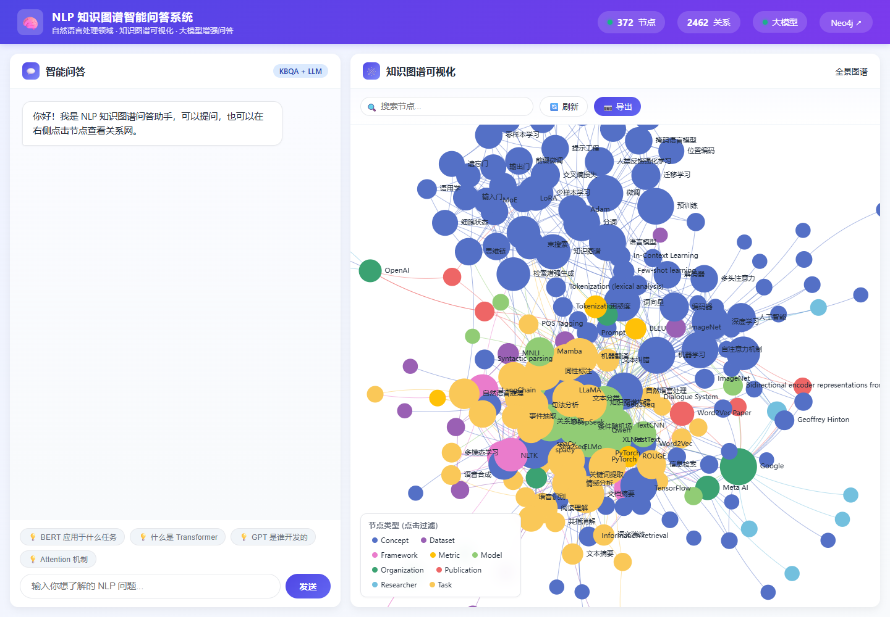
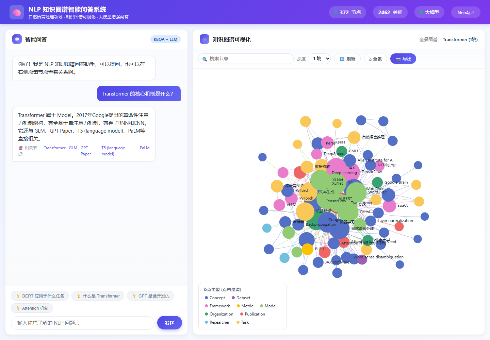

# NLP 知识图谱智能问答系统

面向自然语言处理课程知识的知识图谱构建与智能问答系统。项目完成了从课程语料整理、实体关系抽取、图数据库建模，到 Web 可视化与大模型增强问答的完整闭环。

> 说明：本项目用于课程设计/竞赛展示。因参赛评审与项目保护要求，当前仓库仅公开 README 与系统效果图，暂不公开源码、运行配置、数据库文件、原始数据集或私有凭据。

## 项目概览

系统围绕 NLP 领域概念、模型、任务、数据集、研究者、机构等知识进行结构化组织，支持用户通过自然语言提问，并在图谱视图中查看相关节点及关系网络。

核心能力包括：

- 自动化构建 NLP 课程知识图谱，覆盖实体抽取、关系抽取与图数据库入库流程
- 基于 Neo4j 的知识图谱存储、查询与可视化展示
- 基于 KBQA + LLM 的智能问答，支持概念解释、关联节点推荐和子图联动
- Web 端图谱浏览，支持节点搜索、类型筛选、全景图谱和局部子图查看
- 支持大模型增强回答，用于提升自然语言理解和答案生成质量

## 技术栈

- 后端服务：Python、FastAPI、Uvicorn
- 图数据库：Neo4j、Cypher
- 数据处理：Pandas、NumPy
- NLP 处理：Jieba、spaCy、规则抽取、实体关系抽取
- 智能问答：KBQA、Prompt Engineering、LLM 增强生成
- 前端展示：HTML、CSS、JavaScript、图谱可视化组件
- 工程部署：Linux、screen 会话、远程端口服务

## 系统效果

### 知识图谱总览

### 智能问答与局部子图联动

## 项目数据规模

当前演示版本包含：

- 372 个知识节点
- 2462 条知识关系
- 多类节点类型：Concept、Model、Task、Dataset、Framework、Metric、Organization、Researcher、Publication
- 支持围绕 Transformer、BERT、GPT、Attention 等 NLP 核心知识点进行问答和关系探索

## 项目亮点

- 不是单纯的聊天机器人，而是结合知识图谱检索、结构化知识关系和大模型生成的问答系统
- 图谱可视化与问答结果联动，回答问题时可以同步查看相关节点的局部关系网络
- 采用知识库兜底与 LLM 增强生成结合的方式，兼顾可解释性和自然语言表达质量
- 项目贴近 AI 原生工程师岗位要求，覆盖知识库系统、LLM 调用、Prompt 设计、知识召回、工程部署和产品化展示

## 个人负责内容

- 设计并实现 NLP 课程知识图谱的数据处理与知识抽取流程
- 构建 Neo4j 图数据库 schema，完成实体、关系导入和查询接口封装
- 开发 FastAPI 后端服务与智能问答接口
- 设计 KBQA 问答逻辑，结合图谱查询结果和大模型生成最终回答
- 实现 Web 端图谱展示、节点搜索、类型筛选、局部子图和问答交互
- 在远程 Linux 环境中完成服务部署、screen 会话管理和演示环境维护

## 后续优化方向

- 引入向量检索与 Rerank，提高开放式问题的资料召回准确率
- 扩展课程资料上传能力，支持 PDF、Word、Markdown 等文档自动入库
- 增加答案引用来源和置信度提示，提升问答可信度
- 完善评测集，对问答准确率、召回率和响应延迟进行系统评估
- 加入 Agent Router，让系统根据用户意图自动选择问答、总结、出题或复习计划工具
